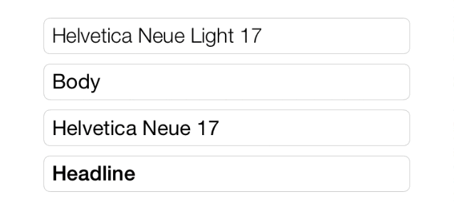

UITextFieldBug
=================

Demo project of a bug on UITextField in iOS 8.1, different vertical text alignment between editing and not editing mode when using some fonts.

Reproducibility
------------------

Always

Affected versions/devices
------------------

All tested devices (and simulator) with iOS 8.1, iOS 8.0 not tested. In iOS 7.1 the bug is not present

Steps to reproduce
------------------

- Add a UITextField
- Set the font to Helvetica Neue Light 17 or a text style like UIFontTextStyleBody or UIFontTextStyleHeadline. May happen with other fonts
- Run
- Tap on the text field

Expected results
------------------

The text don't moves

Actual results
------------------

When the text field becomes the first responder the text moves up a few pixels:

Workaround
------------------

- So far no workaround found to use with a custom font